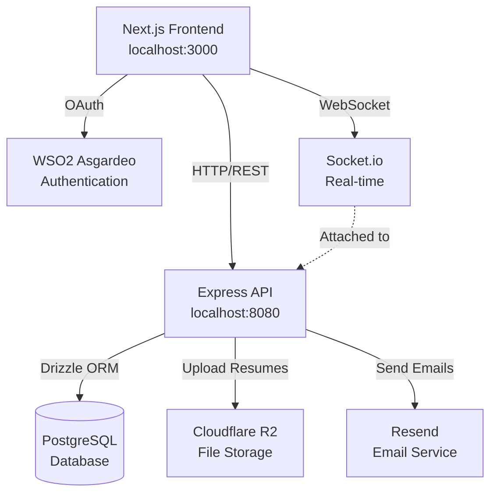
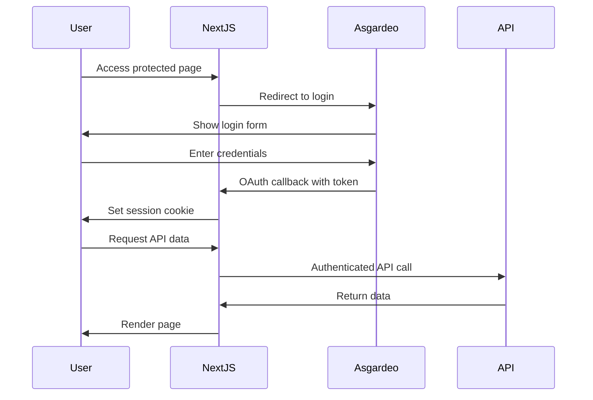

## System Overview

OpenATS is built as a modern monorepo containing two primary applications:

- **`web/`** - Next.js frontend application
- **`api/`** - Express.js backend API

The architecture follows a traditional client-server model with clear separation of concerns, type-safe database operations, and real-time capabilities.



## Tech Stack

### Frontend (`web/`)

The frontend is a modern Next.js application built with the latest React features.

<CardGroup cols={2}>
  <Card title="Next.js 16" icon="react">
    React framework with App Router, server components, and server actions
  </Card>
  <Card title="React 19" icon="react">
    Latest React with improved concurrent features and automatic batching
  </Card>
  <Card title="TypeScript" icon="code">
    Full type safety across the entire frontend codebase
  </Card>
  <Card title="Tailwind CSS 4" icon="palette">
    Utility-first CSS framework for rapid UI development
  </Card>
  <Card title="shadcn/ui" icon="layer-group">
    High-quality React components built with Radix UI and Tailwind
  </Card>
  <Card title="WSO2 Asgardeo" icon="shield-halved">
    Enterprise SSO and authentication with @asgardeo/nextjs
  </Card>
</CardGroup>

#### Key Frontend Dependencies

```json package.json
{
  "dependencies": {
    "next": "16.1.6",
    "react": "19.2.3",
    "react-dom": "19.2.3",
    "@asgardeo/nextjs": "^0.1.79",
    "shadcn": "^3.8.4",
    "lucide-react": "^0.575.0",
    "next-themes": "^0.4.6",
    "react-dnd": "^16.0.1",
    "react-dnd-html5-backend": "^16.0.1",
    "recharts": "2.15.4",
    "sonner": "^2.0.7"
  }
}
```

#### Frontend Features

- **Server Components**: Optimized page loads with React Server Components
- **Drag & Drop**: Candidate pipeline management with `react-dnd`
- **Dark Mode**: System-aware theming with `next-themes`
- **Charts & Analytics**: Hiring metrics visualization with Recharts
- **Toast Notifications**: User feedback with Sonner
- **Responsive Design**: Mobile-first approach with Tailwind breakpoints

### Backend (`api/`)

The backend is a TypeScript-based Express application with comprehensive API documentation.

<CardGroup cols={2}>
  <Card title="Express.js 5" icon="server">
    Fast, unopinionated web framework for Node.js
  </Card>
  <Card title="TypeScript" icon="code">
    Type-safe backend with full IDE autocomplete support
  </Card>
  <Card title="Drizzle ORM" icon="database">
    Type-safe ORM with automatic TypeScript types from schema
  </Card>
  <Card title="PostgreSQL" icon="database">
    Robust relational database with ACID compliance
  </Card>
  <Card title="Socket.io" icon="comments">
    Real-time bidirectional communication for live updates
  </Card>
  <Card title="Swagger UI" icon="book">
    Interactive API documentation at /api-docs
  </Card>
</CardGroup>

#### Key Backend Dependencies

```json package.json
{
  "dependencies": {
    "express": "^5.2.1",
    "drizzle-orm": "^0.45.1",
    "pg": "^8.19.0",
    "socket.io": "^4.8.3",
    "cors": "^2.8.6",
    "dotenv": "^17.2.4",
    "zod": "^4.3.6",
    "@aws-sdk/client-s3": "^3.1000.0",
    "multer": "^2.1.0",
    "resend": "^6.9.3",
    "swagger-ui-express": "^5.0.1"
  },
  "devDependencies": {
    "drizzle-kit": "^0.31.9",
    "nodemon": "^3.1.11",
    "tsx": "^4.21.0"
  }
}
```

#### Backend Features

- **RESTful API**: Standard HTTP methods for all resources
- **Request Validation**: Schema validation with Zod
- **Error Handling**: Centralized error middleware in `api/src/middlewares/error.middleware.ts:4`
- **File Uploads**: Resume handling with Multer and S3-compatible storage
- **Real-time Events**: WebSocket notifications via Socket.io
- **API Documentation**: Auto-generated Swagger docs from OpenAPI spec

## Database Schema

OpenATS uses PostgreSQL with Drizzle ORM for type-safe database operations. The schema is defined in TypeScript and located in `api/src/db/schema/`.

### Core Tables

<Tabs>
  <Tab title="Jobs">
    **`jobs` table** (`api/src/db/schema/jobs.ts`)

    Stores job postings with comprehensive details:

    ```typescript
    {
      id: serial,
      slug: varchar (unique),
      title: varchar,
      departmentId: integer → departments.id,
      employmentType: enum, // full-time, part-time, contract, internship, temporary
      location: varchar,
      description: text,
      salaryType: enum, // fixed, range
      currency: varchar(3), // ISO 4217
      payFrequency: enum, // hourly, weekly, monthly, yearly
      salaryFixed: numeric,
      salaryMin: numeric,
      salaryMax: numeric,
      status: enum, // draft, published
      createdBy: integer → users.id,
      createdAt: timestamp,
      updatedAt: timestamp
    }
    ```

    **Related table**: `job_skills` for required skills per job
  </Tab>

  <Tab title="Candidates">
    **`candidates` table** (`api/src/db/schema/candidates.ts`)

    Stores candidate applications:

    ```typescript
    {
      id: serial,
      firstName: varchar,
      lastName: varchar,
      email: varchar,
      phone: varchar,
      resumeUrl: varchar, // Cloudflare R2 URL
      jobId: integer → jobs.id,
      currentStageId: integer → job_pipeline_stages.id,
      appliedAt: timestamp,
      updatedAt: timestamp
    }
    ```

    **Related tables**:
    - `candidate_stage_history` - Track movement through pipeline
    - `candidate_custom_answers` - Answers to job-specific questions
    - `candidate_cv_analysis` - AI-powered resume analysis with match scores
  </Tab>

  <Tab title="Assessments">
    **`assessments` table** (`api/src/db/schema/assessments.ts`)

    Custom skills assessments:

    ```typescript
    {
      id: serial,
      jobId: integer → jobs.id,
      title: varchar,
      description: text,
      duration: integer, // minutes
      passingScore: numeric, // percentage
      isActive: boolean,
      createdAt: timestamp
    }
    ```

    **Related tables**:
    - `assessment_questions` - Questions with types (multiple choice, checkbox, text)
    - `assessment_question_options` - Answer options with correct flags and points
    - `candidate_assessment_attempts` - Candidate attempt tracking with scores
    - `candidate_assessment_answers` - Individual answers per attempt
  </Tab>

  <Tab title="Pipeline">
    **`job_pipeline_stages` table** (`api/src/db/schema/pipeline.ts`)

    Customizable hiring pipeline:

    ```typescript
    {
      id: serial,
      name: varchar,
      order: integer,
      isDefault: boolean,
      createdAt: timestamp
    }
    ```

    Default stages seeded via `api/src/db/seed.ts`:
    1. Applied
    2. Screening  
    3. Interview
    4. Offer
    5. Hired
  </Tab>
</Tabs>

### Database Migrations

OpenATS uses Drizzle Kit for schema migrations:

<Steps>
  <Step title="Define Schema">
    Edit TypeScript schema files in `api/src/db/schema/`
  </Step>
  <Step title="Generate Migration">
    ```bash
    pnpm drizzle-kit generate
    ```
    Creates SQL migration files in `api/drizzle/`
  </Step>
  <Step title="Apply Migration">
    ```bash
    pnpm drizzle-kit migrate
    ```
    Executes migrations against your database
  </Step>
</Steps>

<Warning>
  Always commit generated migration files along with schema changes. This ensures database consistency across environments.
</Warning>

## Authentication Flow

OpenATS uses WSO2 Asgardeo for enterprise-grade authentication:



### Authentication Features

- **OAuth 2.0 / OIDC**: Industry-standard authentication protocol
- **SSO Support**: Single sign-on with existing enterprise identity providers
- **Session Management**: Secure session handling with `@asgardeo/nextjs`
- **Role-Based Access**: User roles and permissions (future enhancement)

## File Storage Architecture

Resumes and documents are stored in Cloudflare R2 (S3-compatible storage):

<Steps>
  <Step title="Upload">
    Client uploads file via `multer` middleware in Express
  </Step>
  <Step title="Process">
    Backend validates file type and size
  </Step>
  <Step title="Store">
    File uploaded to R2 bucket using AWS SDK v3
  </Step>
  <Step title="Save URL">
    Public R2 URL stored in `candidates.resumeUrl` field
  </Step>
  <Step title="Access">
    Frontend retrieves file via public R2 URL
  </Step>
</Steps>

### Configuration

```bash .env
R2_ENDPOINT=https://your-account.r2.cloudflarestorage.com
R2_ACCESS_KEY_ID=your_access_key
R2_SECRET_ACCESS_KEY=your_secret_key
R2_BUCKET_NAME=openats-resumes
R2_PUBLIC_URL=https://your-r2-domain.com
```

## Real-time Communication

Socket.io enables real-time features for collaborative hiring:

```typescript api/src/server.ts
import http from "http";
import app from "./app";
import { socketService } from "./services/socket.service";

const server = http.createServer(app);
socketService.initialize(server);

server.listen(8080, () => {
  console.log(`OpenATS Backend running on port 8080`);
  console.log(`Socket.io initialized and listening on the same port.`);
});
```

### Real-time Features

- **Candidate Updates**: Live notifications when candidates move through pipeline
- **Application Alerts**: Real-time alerts for new applications
- **Collaborative Hiring**: Multiple recruiters can see live updates
- **System Events**: Broadcast system-wide notifications

## Email Infrastructure

OpenATS integrates with Resend for transactional emails:

```bash .env
RESEND_API_KEY=re_your_api_key
RESEND_FROM_EMAIL=noreply@yourdomain.com
```

### Email Use Cases

- Assessment invitations with unique tokens
- Application confirmations
- Interview scheduling
- Offer letters
- Pipeline status updates

## API Architecture

The Express API is organized with clear separation of concerns:

```
api/src/
├── server.ts          # Entry point, HTTP server setup
├── app.ts             # Express app configuration
├── routes/            # API route definitions
├── controllers/       # Request handlers
├── services/          # Business logic
├── middlewares/       # Express middlewares
├── db/
│   ├── schema/       # Drizzle ORM schemas
│   └── seed.ts       # Database seeding
└── config/           # Configuration files
```

### API Endpoints

All API routes are prefixed with `/api` (defined in `api/src/app.ts:13`):

- **Health Check**: `GET /health` - Server status
- **API Docs**: `GET /api-docs` - Interactive Swagger UI
- **Jobs**: `GET|POST|PUT|DELETE /api/jobs`
- **Candidates**: `GET|POST|PUT|DELETE /api/candidates`
- **Assessments**: `GET|POST|PUT|DELETE /api/assessments`
- **Pipeline**: `GET|POST|PUT|DELETE /api/pipeline`

<Info>
  Visit `http://localhost:8080/api-docs` when running locally to explore the complete API documentation.
</Info>

## Development Workflow

<CodeGroup>
```bash Development
# Terminal 1: Backend
cd api
pnpm dev  # Runs on :8080 with hot reload

# Terminal 2: Frontend  
cd web
pnpm dev  # Runs on :3000 with hot reload
```

```bash Production Build
# Backend
cd api
pnpm build  # Compiles TypeScript to dist/
pnpm start  # Runs compiled JS

# Frontend
cd web
pnpm build  # Creates optimized production build
pnpm start  # Serves production build
```
</CodeGroup>

## Design Decisions

<AccordionGroup>
  <Accordion title="Why Drizzle ORM?">
    Drizzle provides the best balance of type safety, performance, and developer experience:

    - Full TypeScript inference from schema
    - Zero runtime overhead
    - SQL-like query builder
    - Automatic migration generation
    - No decorators or experimental features
  </Accordion>

  <Accordion title="Why Separate Frontend/Backend?">
    While Next.js could handle both, separating them provides:

    - Clear API boundaries
    - Independent scaling
    - Easier testing
    - Flexibility to add other clients (mobile apps, CLI)
    - Simpler deployment strategies
  </Accordion>

  <Accordion title="Why PostgreSQL?">
    PostgreSQL offers:

    - ACID compliance for data integrity
    - Rich data types (JSON, arrays)
    - Powerful indexing and query optimization
    - Excellent tooling ecosystem
    - Free and open source
  </Accordion>

  <Accordion title="Why WSO2 Asgardeo?">
    Asgardeo provides enterprise features without complexity:

    - OAuth 2.0 / OIDC compliance
    - Social login providers
    - Multi-factor authentication
    - Free tier for development
    - Easy integration with Next.js
  </Accordion>
</AccordionGroup>

## Performance Considerations

- **Database Indexes**: Key fields indexed for fast queries (see schema definitions)
- **Connection Pooling**: PostgreSQL connections pooled via `pg` driver
- **Incremental Static Regeneration**: Next.js ISR for optimized page loads
- **Code Splitting**: Automatic route-based splitting in Next.js
- **Image Optimization**: Next.js Image component for optimized images
- **WebSocket Efficiency**: Socket.io rooms for targeted real-time updates

## Security Measures

<CardGroup cols={2}>
  <Card title="Input Validation" icon="shield-check">
    All API inputs validated with Zod schemas
  </Card>
  <Card title="SQL Injection Protection" icon="shield-check">
    Drizzle ORM parameterized queries
  </Card>
  <Card title="CORS Configuration" icon="shield-check">
    Configured CORS policies for API access
  </Card>
  <Card title="Environment Variables" icon="shield-check">
    Sensitive data in .env files (never committed)
  </Card>
  <Card title="Authentication" icon="shield-check">
    OAuth 2.0 via WSO2 Asgardeo
  </Card>
  <Card title="File Upload Limits" icon="shield-check">
    Multer validation for file types and sizes
  </Card>
</CardGroup>

## Next Steps

<CardGroup cols={2}>
  <Card
    title="Contributing Guide"
    icon="code-pull-request"
    href="/development/contributing"
  >
    Learn how to extend and customize OpenATS
  </Card>
  <Card
    title="API Reference"
    icon="book"
    href="/api/overview"
  >
    Explore detailed API endpoint documentation
  </Card>
  <Card
    title="Database Schema"
    icon="database"
    href="/development/database"
  >
    Deep dive into the data model
  </Card>
  <Card
    title="Development Setup"
    icon="rocket"
    href="/development/setup"
  >
    Set up OpenATS for local development
  </Card>
</CardGroup>
